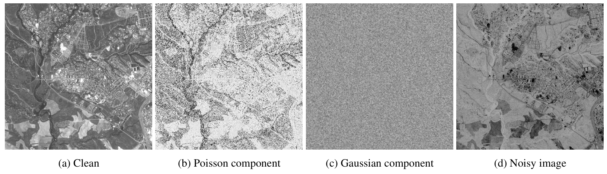
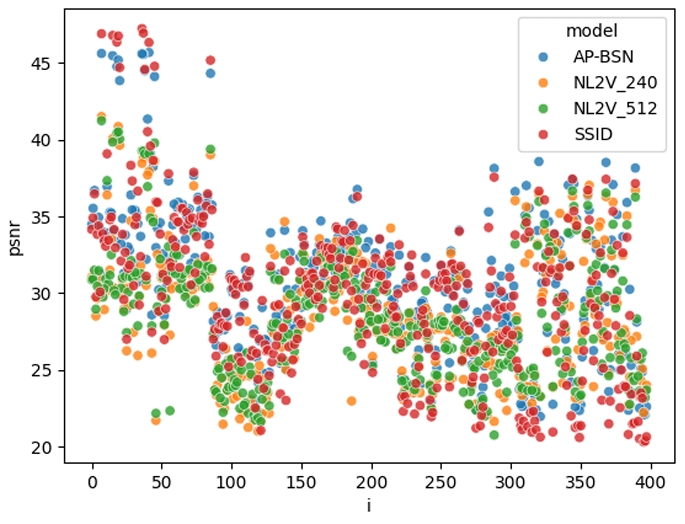
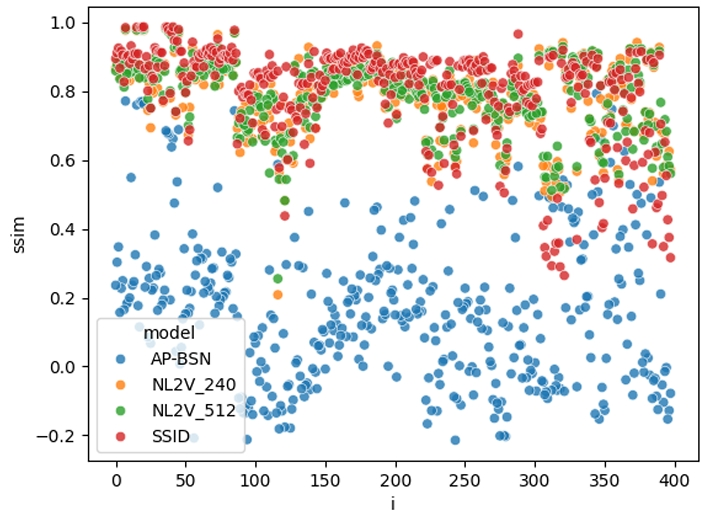

# Satellite Imagery Denoising Models

This repository contains implementations and evaluations of three self-supervised denoising models for enhancing low-cost satellite imagery.

## Authors

- **Filippo Balzarini** - filippo.balzarini@mail.polimi.it - Politecnico di Milano 
- **Michele Cavicchioli** - michele.cavicchioli@mail.polimi.it  - Politecnico di Milano

## Overview

This project investigates whether imagery acquired from hypothetical low-cost satellites (characterized by spatially correlated noise) can be made suitable for land monitoring tasks through modern denoising techniques. The evaluation focuses on three state-of-the-art architectures based on Blind-Spot Networks (BSN).

## Evaluated Models

### 1. AP-BSN (Asymmetric PD Blind-Spot Network)
**Repository:** [AP-BSN Implementation](https://github.com/filomba01/AP-BSN.git)

A self-supervised denoising approach that uses pixel-shuffle downsampling to generate multiple patches with reduced noise correlation. The asymmetric architecture applies blind-spot constraints to these downsampled images.

### 2. NL-N2V (Non-Local Noise2Void)
**Repository:** [NL-N2V Implementation](https://github.com/TrueMaicol/NL-N2V.git)

Extends the original Noise2Void by introducing a non-local masking strategy, replacing masked regions with similar distant patches. Particularly effective for spatially correlated noise.

### 3. SSID (Spatially Adaptive Self-Supervised Image Denoising)
**Repository:** [SSID Implementation](https://github.com/filomba01/SpatiallyAdaptiveSSID.git)

Combines a blind-neighborhood network for flat regions with a locally aware network for textured areas, weighted by local flatness. This adaptive approach balances noise removal across different image characteristics.

## Dataset

The evaluation used Sentinel-2 satellite imagery from multiple urban locations:
- Rome, Paris, Madrid, Tokyo, London, Milan
- Acquisition dates: 2023-2024
- Bands: B04 (Red), B03 (Green), B02 (Blue)
- Total images: 3,979 patches (512×512 pixels)
- Split: 80% training, 10% validation, 10% testing

## Noise Model

A two-stage synthetic noise injection process simulates low-cost satellite conditions:

1. **Poisson (Photon) Noise:** Models photon-limited sensor noise
2. **Gaussian (Electronic) Noise:** Band-dependent electronic noise with spatial correlation

Parameters:
- Photon scale: 1000
- Noise boost: 10.0
- Gaussian kernel: 5×5, σ = 0.55
- SNR values: {230, 249, 214} for R, G, B bands (official Copernicus calibration [report](https://www.mdpi.com/2072-4292/9/6/584))

*Noise injection procedure*

## Evaluation Metrics

- **SSIM (Structural Similarity Index):** Measures structural preservation and perceptual quality
- **PSNR (Peak Signal-to-Noise Ratio):** Measures pixel-level reconstruction accuracy

## Results

| Model | SSIM  | PSNR  | Patch size |
| ---   | ---   | ---   | ---        |
| APBSN | 0.164 | **30.71** | 480x480    |
| NLN2V | 0.787 | 28.56 | 240x240    |
| NLN2V | 0.789 | 28.45 | 512x512    |
| SSID  | **0.799** | 29.92 | 512x512    |

*PSNR per image*

*SSIM per image*

## Key Findings

✅ **Strengths:**
- All models effectively reduce noise levels
- Suitable for large-scale structure analysis (agricultural fields, major buildings)

⚠️ **Limitations:**
- Significant loss of fine details across all models
- Reduced performance in low-contrast scenarios
- Challenges in dense urban environments
- Blind-spot mechanisms inherently suppress small-scale textures

